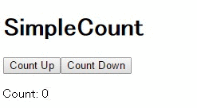

# SimpleCount

Fluxアーキテクチャを使ったカウントアプリです。ボタンをクリックするとカウントアップ/カウントダウンします。内部のソースでFluxの構成を確認するのが目的です。



## Requirement

[node.js](https://nodejs.org/en/)のインストールが必要になります。  
動作確認には[http-server](https://www.npmjs.com/package/http-server)パッケージを使いました。

```
$ npm install -g http-server
```

## Install

```
$ npm install
```

## Usage

```
$ npm run build
$ http-server
```

Webサーバーが立ち上がったらブラウザでアクセスしてください。

## LICENCE

MIT
